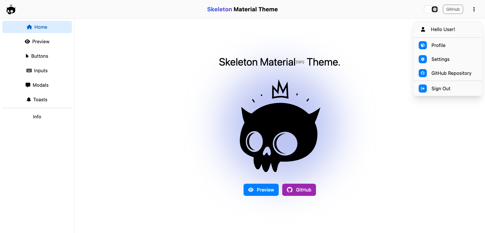

# Skeleton Material Theme

A an example app which attempts to create a Material-like theme using [SvelteKit](https://kit.svelte.dev/)
and [Skeleton](https://www.skeleton.dev/) UI.

This site demo has been deployed to [GitHub pages](https://plasmatech8.github.io/skeleton-material-theme/).



## Theme

### Configuration

The theme is configured in two files:

* [material.ts](https://github.com/plasmatech8/skeleton-material-theme/blob/main/src/material.ts) &nbsp;&nbsp;&nbsp;&nbsp; <- The main theme file for Skeleton
* [app.postcss](https://github.com/plasmatech8/skeleton-material-theme/blob/main/src/app.postcss) &nbsp; <i class="fa-solid fa-left-long"></i> <- Contains some extra styles & CSS corrections

### Ripple

For the ripple-effect, ~~the [svelte-ripple-action](https://github.com/Posandu/svelte-ripple-action)
NPM package was installed~~. Currently using a modified version of this library located in [src/lib/svelte-ripple-action](src/lib/svelte-ripple-action).

To add the Ripple effect to a button or anchor tag, you can use the `use:ripple` Svelte action.

e.g.
```svelte
<button class="btn variant-filled-primary" use:ripple>primary</button>
```

> [!NOTE]
>
> The default color of the ripple is set to the text color (in [app.postcss](https://github.com/plasmatech8/skeleton-material-theme/blob/main/src/app.postcss)).


> [!WARNING]
>
> The ripple effect will not be added to child elements of pre-built components because these elements (i.e. buttons) are not exposed to the developer and `use:ripple` cannot be added.
>
> Pre-built components such modals, paginators and steppers - will not have the ripple effect added unless you configure JavaScript, as described below.

#### Automatic global ripple effect

If you want the ripple effect to be configured globally without needing to use `use:ripple`, it is worth considering adding JavaScript to apply the ripple effect to all elements with certain classes.

This would allow buttons inside of pre-built components (modals, toasts, stepper-form, etc) to have ripple effects.

For example, below is an Svelte action which you can put in your `+layout.svelte` to automatically add ripple effects to all elements with class `btn` or `btn-icon`:

```ts
/**
 * Every 100ms, add ripple effect to all .btn, .btn-icon class elements
 * if they do not already have a ripple effect configured.
 */
function rippleBtnClass(e: Element) {
    setInterval(() => {
        const btns = e.querySelectorAll('.btn, .btn-icon');
        btns.forEach((el) => {
            if (!el.classList.contains('ripple-effect')) {
                ripple(el as HTMLElement);
            }
        });
    }, 100);
}
```

Usage:

```svelte
<svelte:body use:rippleBtnClass />
```
